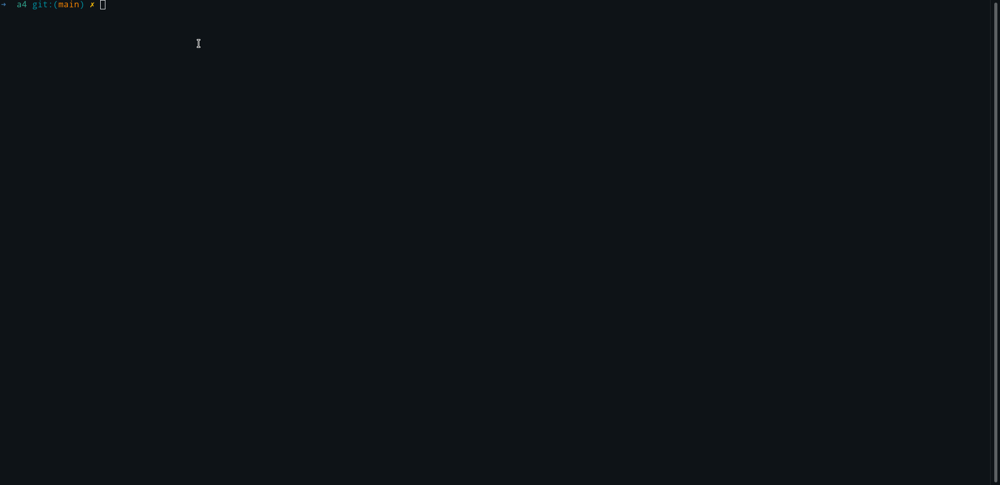

# VM Editor
VM is a vim-like editor made as the final project in CS246E, the enriched object-oriented course at UW (University of Waterloo). It is written in C++ using the ncurses library. I have included the VM editor executable in this repository because UW does not allow showing course-related source code on a public repository.

## How to Run
On Linux systems, just clone the repository and run the executable with `./vm` or `./vm [file-to-edit]`. VM supports Normal Mode, Insert Mode, Replace Mode, ^F, ^B , :w, :q, :q! :wq, :0, :$, :line-number.
